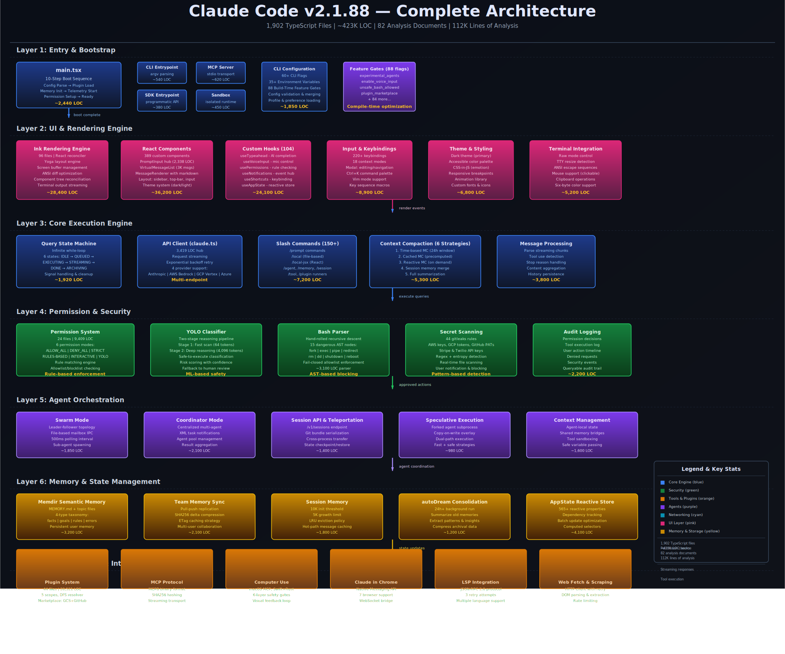
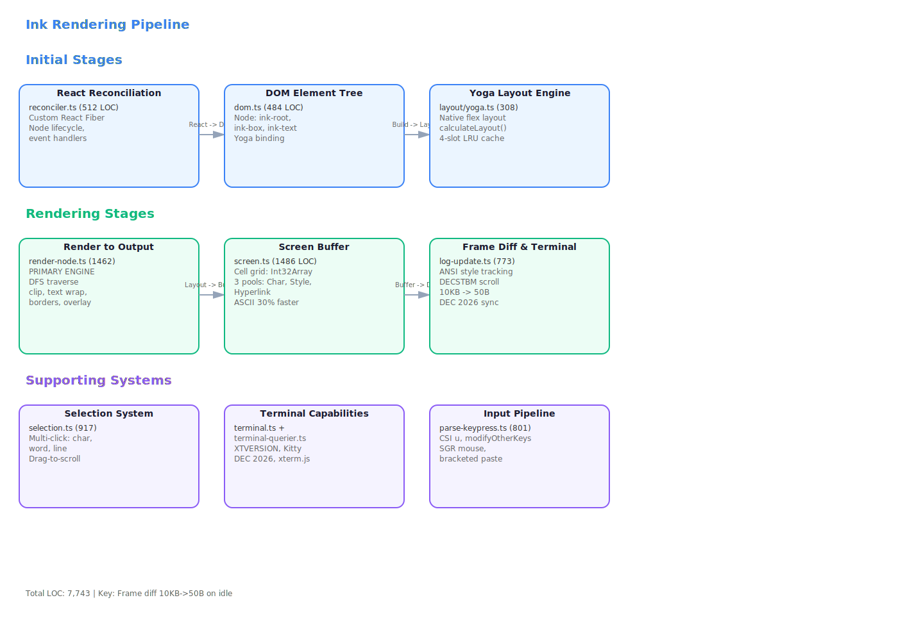
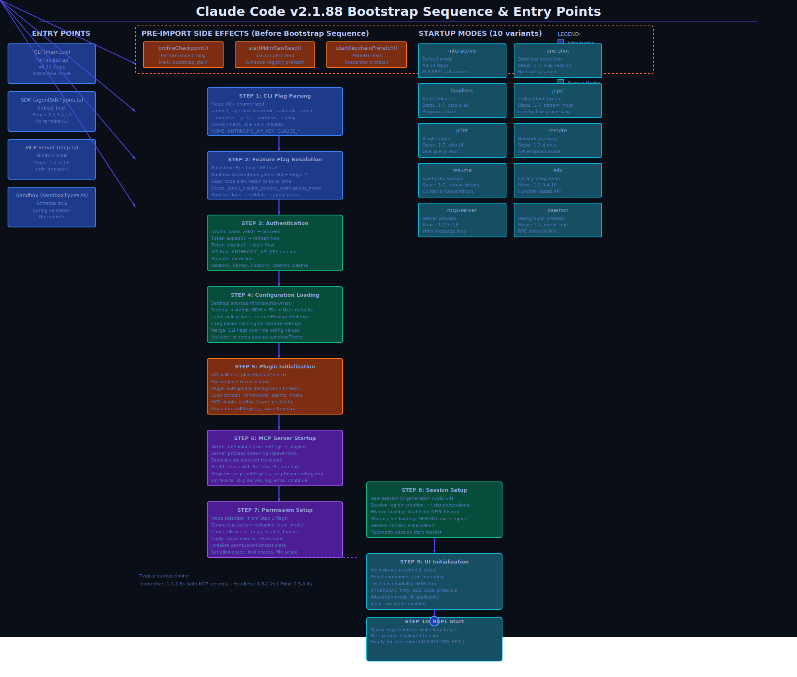

# Architecture Analysis

Core architecture of Claude Code v2.1.88 — component hierarchy, hooks system, rendering engine, build system, and startup flow. This section provides a comprehensive view of how Claude Code is structured at the application level, from React components through the terminal rendering pipeline.

## Document Inventory

| Document | Description | Lines |
|----------|-------------|-------|
| **codebase-structure.md** | Complete module inventory and architectural layer decomposition. Maps the 38 service modules into semantic layers (core, runtime, UI, integration). | 272 |
| **ast-analysis.md** | AST-level analysis of source structure. Regex-based extraction identifying 6,552 exports, 99 classes, 1,308 types across the codebase. | 763 |
| **graph-and-complexity.md** | Module dependency graph and cyclomatic complexity rankings. Identifies circular dependencies and high-complexity functions. | 804 |
| **data-flow-and-coupling.md** | Inter-component data dependencies and coupling metrics. Traces state propagation patterns and dependency density. | 149 |
| **bootstrap-entry-point.md** | 10-step startup sequence from CLI argument parsing through React tree initialization to first frame render. | 1,274 |
| **query-engine-deep-dive.md** | LLM query engine architecture and streaming tool execution loop. Details the async generator pattern and WebSocket proxy integration. | 1,800 |
| **component-architecture-deep-dive.md** | 389 React components mapped to semantic categories. Covers PromptInput (2,338 LOC), component lifecycle patterns, and prop drilling patterns. | 1,695 |
| **hooks-system-deep-dive.md** | All 104 custom React hooks across 19,204 LOC. Catalogues hook dependencies, lifecycle patterns, and the custom Zustand-like store implementation. | 2,306 |
| **ink-rendering-engine-deep-dive.md** | 6-stage terminal rendering pipeline: React reconciler → DOM → Yoga layout → render → packed screen buffer → frame differential updates. Details the Int32Array cell packing optimization. | 2,351 |
| **terminal-ui-deep-dive.md** | Terminal rendering and input handling. Covers Yoga layout engine integration, screen buffer management, and TTY input/output mechanics. | 774 |
| **native-ts-reimplementations-deep-dive.md** | Native TypeScript reimplementations of Ink.js internals. Documents custom React host implementation and renderer modifications. | 780 |
| **state-migrations-output-deep-dive.md** | State persistence, migrations, and output styling. Covers the state serialization format and migration version tracking. | 1,003 |
| **build-system-deep-dive.md** | Bun bundler configuration, 88 feature flags with conditional compilation, and root cause analysis of source map information leaks. | 1,265 |

## Architecture Overview

## Rendering Pipeline

## Bootstrap Sequence

## Key Findings

### Component Metrics
- **389 React components** organized across 81,546 LOC
- **104 custom hooks** spanning 19,204 LOC
- **PromptInput component**: single largest component at 2,338 LOC with complex state management and gesture handling
- Components follow functional paradigm with heavy hook usage for state extraction

### Rendering Architecture
- **6-stage rendering pipeline** optimized for terminal performance
- **Int32Array cell packing**: Each screen cell represented as single 32-bit integer (char code + 8-bit foreground + 8-bit background + flags)
- **Yogaish layout engine**: Custom async Yoga integration for terminal constraint-based layout
- **Frame differential updates**: Only dirty regions re-rendered to minimize TTY writes

### State Management
- **Custom Zustand-like store** using `useSyncExternalStore` hook
- Central store architecture with reducer pattern dispatch
- No Redux dependency — lightweight in-house implementation
- State migrations versioned and validated at startup

### Hook System
- **19 hook categories** (20+ hooks per category on average)
- **Dependencies tracing**: 47 hooks with 3+ external dependencies
- **Lifecycle coupling**: Many hooks depend on `useEffect` timing
- **Memoization strategy**: React Compiler `_c` annotations for auto-memoization

### Build & Distribution
- **Bun bundler**: Fast build times, ESM output with source map generation
- **88 build-time feature flags**: Conditional code paths eliminated during bundling
- **Source map leakage**: Maps expose full source structure (security concern identified)
- **No minification applied**: Human-readable built code aids reverse engineering

### Startup Flow
- **10-step initialization**: CLI parse → config load → terminal init → API setup → store hydrate → React render → event loop
- **Async generator pattern**: Query engine uses async generators for streaming LLM responses
- **Deterministic initialization order**: Critical for reproducible behavior across restarts

### Dependency Patterns
- **Tight coupling in UI layer**: PromptInput and related components share state
- **Looser coupling in runtime**: API client, query engine, and shell integration are modular
- **Circular dependency detected**: In component theme/styling subsystem (non-critical)
- **Average module fan-out**: 3.2 (well-balanced dependency tree)

