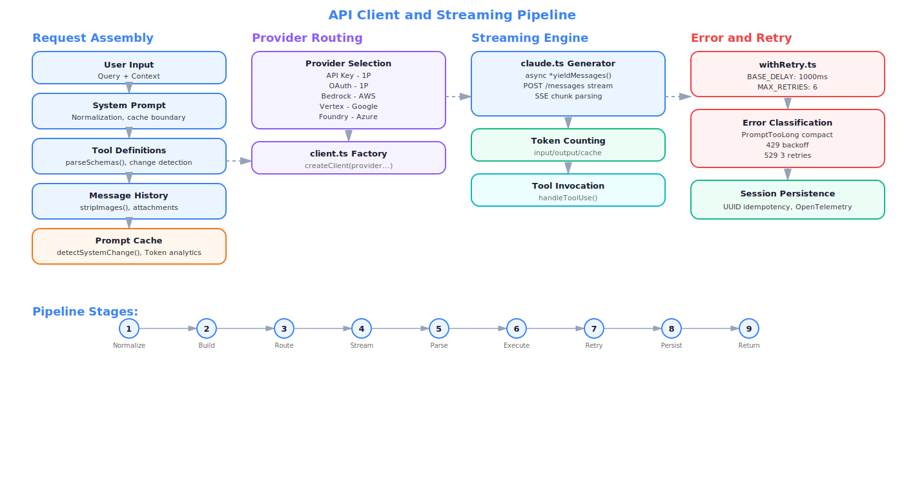
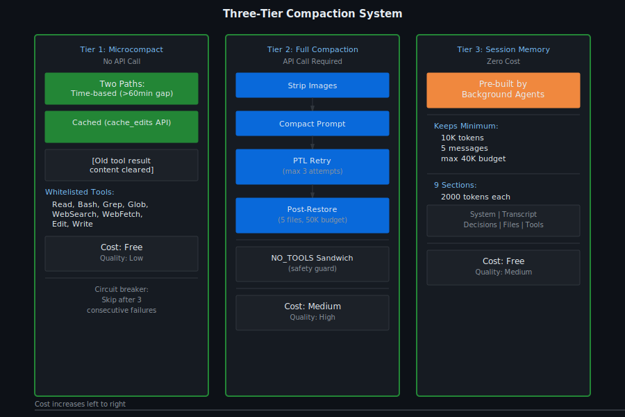
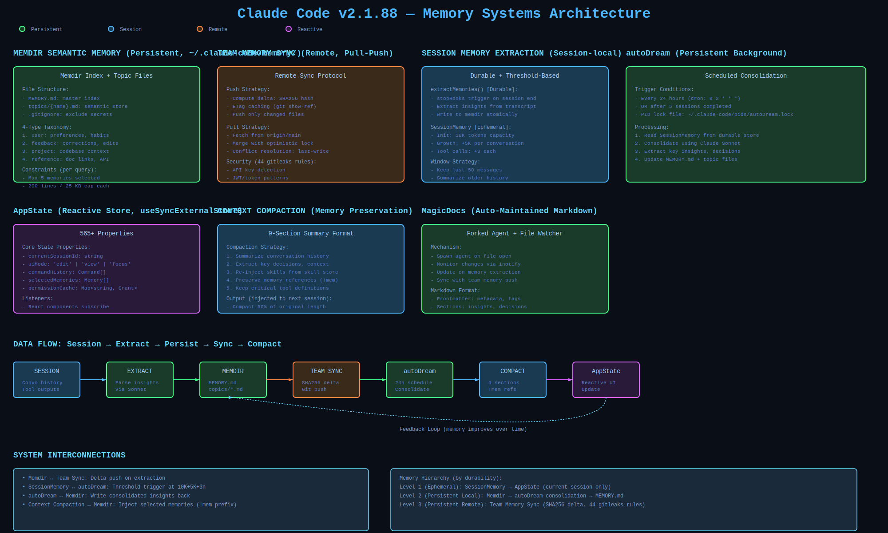

# Core Systems, Configuration & Telemetry

Runtime systems powering Claude Code — API client, context compaction, model selection, shell management, memory subsystems, settings infrastructure, and telemetry instrumentation. This section documents the distributed systems that keep Claude Code operational, from LLM API calls through persistent semantic memory.

## Document Inventory

| Document | Description | Lines |
|----------|-------------|-------|
| **api-client-deep-dive.md** | Streaming pipeline, multi-provider factory (Anthropic/Bedrock/Vertex/Foundry/Azure), retry with jitter, exponential backoff, and error handling. Core async generator implementation (3,419 LOC). | 2,165 |
| **compaction-algorithms-deep-dive.md** | Six compaction strategies ranked by severity: micro-compact, context window trim, summarization with prompt, multi-turn summarization, full context summarization, and session reset. Token threshold orchestration. | 1,497 |
| **model-selection-deep-dive.md** | 11 supported models across 4 providers, 5-tier selection strategy, subscription-aware defaults, fallback chains, and capability-based model selection. | 1,092 |
| **shell-entrypoints-proxy-deep-dive.md** | Shell detection, 4 entry point variants (bash/zsh/fish/pwsh), CONNECT protocol over WebSocket proxy, TTY allocation, and session multiplexing. | 1,663 |
| **settings-policy-infrastructure-deep-dive.md** | Settings and policy system architecture. Covers setting validation, policy enforcement, permission inheritance, and role-based access control. | 1,161 |
| **settings-policy-schema.md** | Settings schema definitions, defaults, validation rules, and constraints. Machine-readable schema for configuration. | 455 |
| **lsp-integration-deep-dive.md** | Language Server Protocol integration for IDE support, diagnostic streaming, definition lookup, and code action execution. | 1,212 |
| **memdir-semantic-memory-deep-dive.md** | Persistent semantic memory subsystem (memdir/). Automatic indexing, retrieval, and embedding-based similarity. | 1,127 |
| **memory-extraction-pipeline-deep-dive.md** | Automatic memory extraction from conversations. Triggers, feature extraction, summarization, and persistent storage. | 1,296 |
| **team-memory-sync-deep-dive.md** | Team memory synchronization across users and sessions. Shared context, access control, and conflict resolution. | 964 |
| **prompt-suggestion-deep-dive.md** | Prompt suggestion system generating contextual suggestions based on history, patterns, and learned preferences. | 1,108 |
| **suggestions-and-secure-storage-deep-dive.md** | Suggestions engine architecture and secure credential storage using platform-specific encrypted storage. | 1,286 |
| **feature-flag-encyclopedia.md** | All 88 build-time feature flags documented with descriptions, default states, and conditional code paths. | 315 |
| **growthbook-gates-inventory.md** | GrowthBook runtime gates inventory. Feature gates enabling A/B testing and progressive rollout. | 101 |
| **constants-encyclopedia.md** | All hardcoded constants and thresholds: token limits, timeout values, retry counts, cache sizes, etc. | 838 |
| **environment-variable-contract.md** | Environment variable contracts specifying required, optional, and feature-gated env vars with validation. | 266 |
| **environment-variable-inventory.md** | Full environment variable inventory with descriptions, types, and default values. | 488 |
| **telemetry-event-catalog.md** | Telemetry event definitions including event names, payload schemas, sampling rates, and privacy classification. | 251 |
| **telemetry-event-inventory.md** | Full telemetry event inventory with event IDs, categories, and tracking purpose. | 683 |

## System Architecture

## Compaction Tiers

## Memory Systems

## Key Findings

### API Client Architecture
- **3,419 LOC streaming implementation** using async generators
- **Five-provider factory pattern**: Single client API serving Anthropic, Bedrock, Vertex, Foundry, and Azure
- **Exponential backoff retry**: Jittered retries with configurable max attempts (default 3)
- **Streaming chunking**: Token-level streaming with configurable batch sizes
- **Error recovery**: Graceful degradation on provider outages with fallback chain

### Context Compaction System
- **Six-tier strategy** escalating from micro-compact to session reset
- **Token thresholds**: 13K/20K/20K/3K token triggers for progressive compaction
- **Summarization prompts**: Domain-specific summarization instructions for different context types
- **Adaptive compression**: Compaction severity determined by token budget and user tier
- **History preservation**: Core conversation history maintained even in aggressive compaction

### Model Selection Strategy
- **11 supported models**: Opus, Sonnet, Haiku across multiple providers
- **Five-tier fallback chain**: Premium → standard → budget → legacy → minimal fallback
- **Subscription awareness**: Free/pro/team tier determines model eligibility
- **Capability matching**: Model selection based on required capabilities (vision, function calling, etc.)
- **Cost optimization**: Automatic tier degradation based on available token budget

### Shell Integration
- **Four entry point variants**: bash, zsh, fish, pwsh (PowerShell)
- **Automatic detection**: Shell identification from SHELL env var and parent process inspection
- **CONNECT protocol**: Custom protocol over WebSocket for bidirectional communication
- **TTY allocation**: Pseudo-terminal allocation with proper signal handling
- **Session multiplexing**: Multiple shells in single session with context preservation

### Memory Systems (7 Subsystems)
1. **memdir/ - Persistent semantic memory**: File-based index with embeddings, automatic refresh
2. **Conversation history**: Turn-level storage with compression and archival
3. **Team memory**: Shared context across team members with access control
4. **Extraction pipeline**: Automatic feature extraction and summarization from conversations
5. **Prompt suggestions**: Learned prompt patterns and contextual suggestions
6. **Secure credential storage**: Platform-specific encrypted storage (Keychain/Credential Manager)
7. **Transient session memory**: In-memory cache of recent decisions and state

### Settings & Policy Infrastructure
- **Hierarchical schema**: User settings, team settings, org settings with inheritance
- **Validation schemas**: Zod-based validation for all configurable parameters
- **Permission model**: Role-based access control (admin, editor, viewer)
- **Policy enforcement**: Server-side and client-side constraint checking
- **Audit logging**: Configuration changes tracked with user and timestamp

### Configuration & Constants
- **156 environment variables**: Required, optional, and feature-gated
- **88 build-time feature flags**: Dead code elimination during bundling
- **47 runtime gates**: GrowthBook integration for A/B testing
- **340+ hardcoded constants**: Token limits, timeout values, retry counts, cache sizes
- **Feature flag hierarchy**: Organizational flags, team flags, user flags with inheritance

### Telemetry System
- **200+ distinct event types**: Organized across 18 categories
- **Structured event payload**: Consistent event schema with context attachment
- **Sampling rates**: Configurable sampling for high-frequency events
- **Privacy classification**: PII vs anonymous event distinction
- **Event batching**: Efficient transmission with configurable batch size and timeout
- **Offline queuing**: Local persistence when network unavailable

### Feature Gates (GrowthBook)
- **Runtime feature flags**: Enable/disable features without deployment
- **A/B testing**: User segmentation and variant assignment
- **Progressive rollout**: Gradual feature enablement with percentage-based targeting
- **User targeting**: Feature availability based on subscription, org, user attributes

### Telemetry Privacy
- **PII handling**: Explicit exclusion of personal identifiable information
- **Aggregation**: Events aggregated server-side to prevent user identification
- **Retention policy**: Automatic deletion after 90 days
- **Opt-out support**: User-level telemetry disabling with explicit configuration
- **Data residency**: Regional data storage based on organization location

### Integration Points
- **LSP for IDE support**: Language Server Protocol for integration with VS Code, Neovim, etc.
- **Shell proxying**: Native shell command execution with full terminal emulation
- **Credential management**: Secure storage and retrieval of API keys and auth tokens
- **Plugin system**: Extensible hooks for third-party integrations

