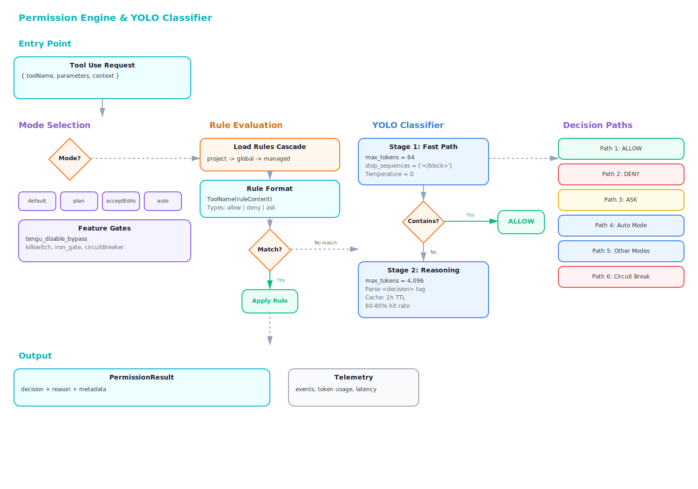
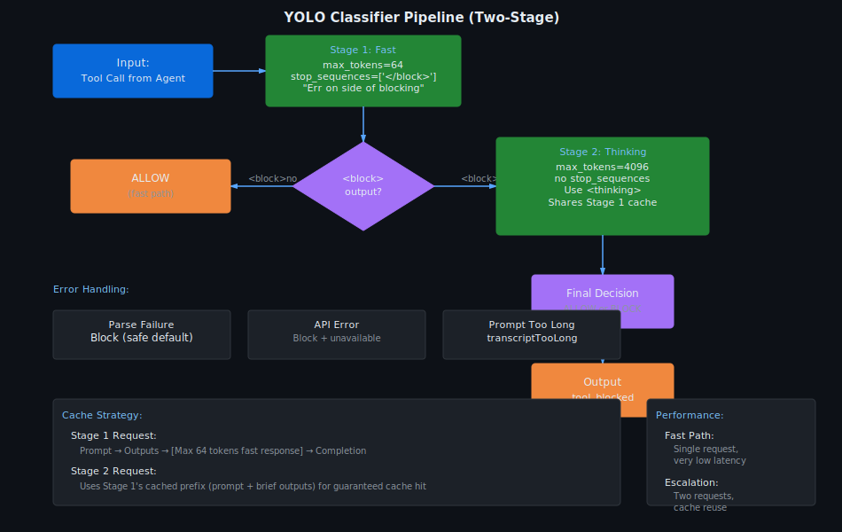

# Security Analysis

Security hardening, threat modeling, and vulnerability analysis of Claude Code. This section covers the permission engine with its two-stage YOLO classifier, the hand-rolled bash parser with fail-closed design, OAuth lifecycle management, and comprehensive security audits across all subsystems.

## Documents

| Filename | Description | Lines |
|----------|-------------|-------|
| **permissions-yolo-deep-dive.md** | Two-stage YOLO classifier (64-token fast-pass + 4,096-token reasoning), 6 permission modes (default, plan, acceptEdits, bypassPermissions, dontAsk, auto), 7-stage decision pipeline, filesystem protection with Windows ADS detection, denial tracking with auto-escalation | 1,041 |
| **bash-parser-deep-dive.md** | Hand-rolled recursive descent parser (fail-closed allowlist design), tree-sitter AST analysis, 15 dangerous AST node types, 35+ blocked builtins, subscript arithmetic RCE detection, semantic post-checks, dangerous pattern stripping on auto mode entry | 1,399 |
| **deep-security-audit.md** | Comprehensive security audit across all subsystems covering cryptography, authentication, access controls, and vulnerability patterns | 154 |
| **security-audit.md** | Security audit findings and recommendations | 93 |
| **oauth-lifecycle-deep-dive.md** | OAuth 2.0 authorization code flow, PKCE flow implementation, token lifecycle management, refresh token handling, state validation and session security | 1,143 |
| **desanitization-map.md** | De-sanitization patterns and lookup tables for detecting vulnerable data transformation chains | 144 |
| **team-memory-security.md** | Team memory subsystem security considerations, credential isolation, and inter-agent message confidentiality | 616 |
| **terminal-ui-security.md** | Terminal UI attack vectors, keyboard input security, rendering safety, and output sanitization | 450 |

## Architecture Diagrams

Permission engine decision pipeline: 7-stage flow from tool request through deny/ask rules to final permission decision.

Two-stage YOLO classifier: Stage 1 (64-token fast-pass on explicit denials) routes to Stage 2 (4,096-token reasoning) for full context analysis.

## Key Findings

### Permission System

- **6 Permission Modes**: `default` (user prompted), `plan` (review phase), `acceptEdits` (file operations only), `bypassPermissions` (skip all except safety), `dontAsk` (convert ask to deny), `auto` (YOLO classifier decides)
- **7-Stage Decision Pipeline**: deny rules → ask rules → tool checkPermissions() → bypass logic → entire-tool rules → passthrough conversion → classifier/fallback
- **YOLO Classifier**: Two-stage design with 64-token fast-pass (explicit denials) and 4,096-token reasoning for nuanced decisions
- **Denial Escalation**: 3 consecutive or 20 total denials trigger automatic fallback to manual approval mode
- **Dangerous Mode Stripping**: Auto mode automatically removes permission rules that would bypass the classifier to prevent circumvention
- **Feature-Gated Killswitch**: GrowthBook controls disable `bypassPermissions` and `auto` modes at runtime for safety rollback

### Bash Parser Security

- **Fail-Closed Design**: Hand-rolled recursive descent parser with allowlist-based AST node filtering
- **15 Dangerous Node Types**: Control flow structures, compound operations, patterns blocked in security-sensitive contexts
- **35+ Blocked Builtins**: Dangerous shell operations (eval, source, trap, enable, declare, typeset, etc.) rejected outright
- **Subscript Arithmetic Detection**: Array subscript operations with arithmetic expressions caught as RCE vectors
- **Path Constraint Checking**: Detects relative path escapes, newline injection, hash-based path manipulation
- **4,437 LOC Implementation**: 23 files across parser, AST walker, semantic checker, and permission matcher

### OAuth Security

- **Authorization Code Flow**: Standard OAuth 2.0 with PKCE for public clients
- **State Validation**: CSRF protection via state parameter verification
- **Token Caching**: 1-hour TTL with prompt caching for system context across classifier calls
- **Refresh Token Safety**: Secure token rotation and expiration handling

### Additional Security Controls

- **Windows ADS Detection**: Alternate Data Stream protection for Windows filesystem operations
- **Team Memory Isolation**: Credential separation between agents in swarm orchestration
- **Terminal Rendering Safety**: Output sanitization and keyboard input validation
- **De-sanitization Prevention**: Lookup tables for detecting vulnerable data transformation chains

---

**Analysis Date**: 2026-04-02
**Codebase Path**: `/sessions/cool-friendly-einstein/mnt/claude-code/src/utils/permissions/`, `/src/utils/bash/`
