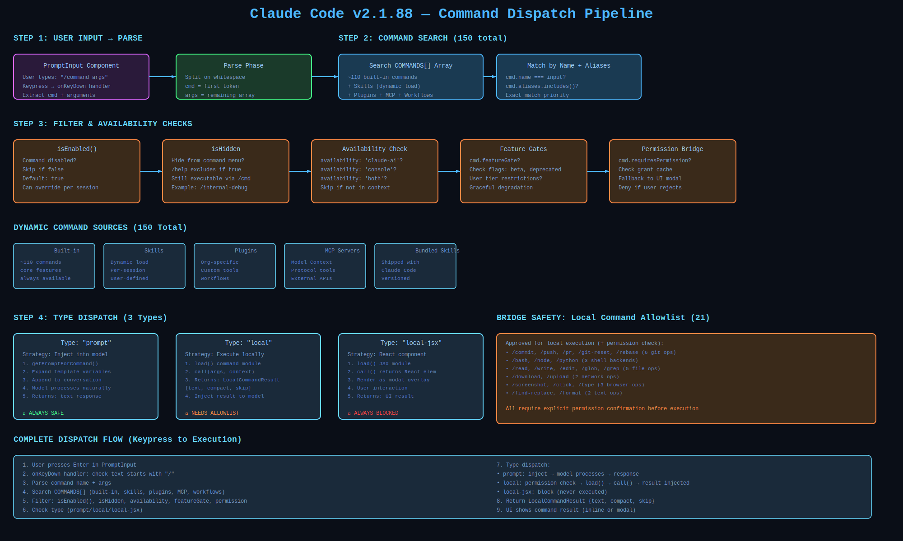
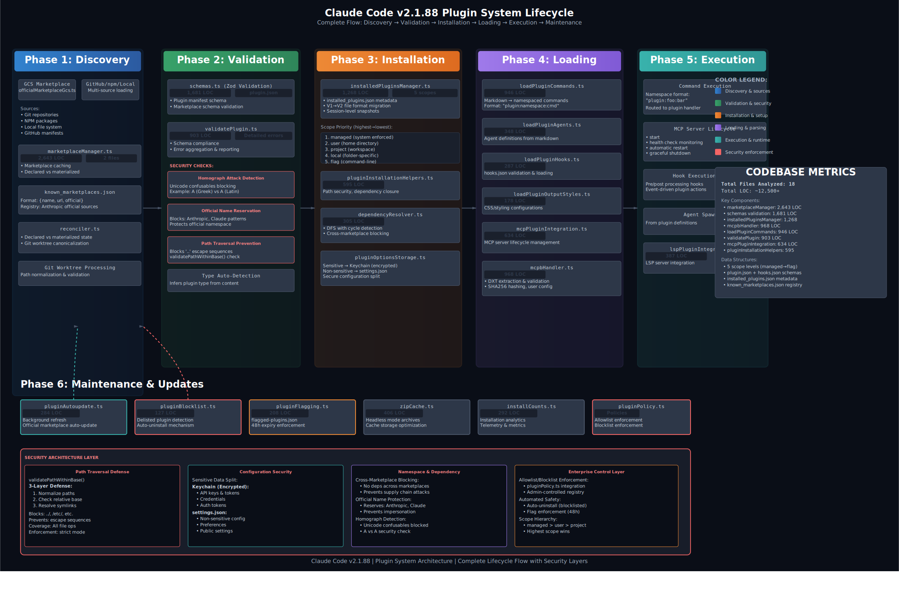
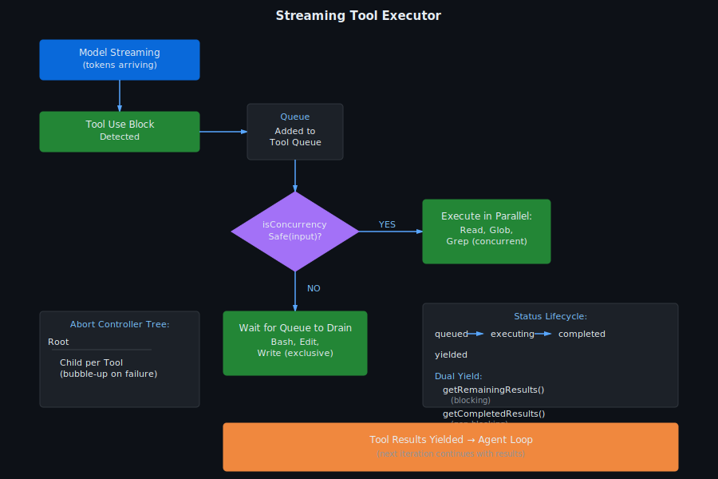

# Tools, Commands & Plugin System

Complete analysis of Claude Code's tool execution, command dispatch, plugin lifecycle, skill system, and extension points. This section covers the ~150 built-in commands, dynamic plugin system with 20,521 LOC across 44 files, MCP integration, computer-use capabilities, and the Claude-in-Chrome extension.

## Documents

| Filename | Description | Lines |
|----------|-------------|-------|
| **command-system-deep-dive.md** | 189 command files with 26,428 LOC, 3 execution types (prompt/local/local-jsx), memoized registry, dynamic loading, feature-flagged conditional imports, auth-gating for Anthropic-only commands, 3,200-line /insights command | 1,850 |
| **plugin-system-deep-dive.md** | 44-file plugin system with 20,521 LOC, full lifecycle (discovery → validation → install → execute → update → delist), five-scope priority merging (managed > user > project > local > flag), DFS dependency resolution with cycle detection, homograph attack detection | 1,279 |
| **tool-contract-inventory.md** | Complete catalog of tool contracts and execution interfaces | 335 |
| **command-tool-skill-surface.md** | Mapping of command/tool/skill surface area and execution boundaries | 422 |
| **computer-use-deep-dive.md** | Computer use implementation, screen capture, input handling, action sequences | 542 |
| **computer-use-protocols.md** | Computer use protocol specifications and API contracts | 757 |
| **claude-in-chrome-deep-dive.md** | Chrome extension integration, tab management, DOM manipulation, JavaScript execution context, content scripts | 1,764 |
| **buddy-system-deep-dive.md** | Companion sprite/buddy system, animation, state management, interactive UI feedback | 886 |
| **bundled-skills-catalog.md** | Built-in skills inventory and capabilities | 288 |
| **keybindings-system.md** | Keybinding system architecture, modifier detection, terminal compatibility | 589 |
| **plugin-marketplace-contract.md** | Plugin marketplace APIs, submission requirements, versioning contracts | 367 |
| **small-services-deep-dive.md** | Smaller service subsystems and utility providers | 951 |
| **utility-subsystems-deep-dive.md** | Utility subsystems including logging, caching, state management | 1,155 |
| **unmapped-systems.md** | Remaining unmapped areas and TODO items | 149 |

## Architecture Diagrams

Command dispatch flow: command lookup → feature-flag evaluation → auth-gating → execution model selection (prompt/local/local-jsx).

Plugin lifecycle: discovery → validation → installation → hook registration → execution → update checks → delisting.

Streaming tool executor architecture for managing concurrent tool invocations with resource limits and cancellation.

## Key Findings

### Command System

- **~150 Built-in Commands**: 189 command files with 26,428 LOC covering operations, debugging, workflows, and analysis
- **3 Execution Types**:
  - `prompt` — Commands rendered as text and invoked by the model
  - `local` — JavaScript/TypeScript executed locally in Node.js
  - `local-jsx` — Terminal UI components rendered via Ink
- **Memoized Registry**: `COMMANDS()` function caches results to avoid repeated environment reads and config file I/O
- **Feature-Flagged Loading**: Conditional imports using Bun's `feature()` API defer expensive commands until bundling
- **Auth-Gated Commands**: `INTERNAL_ONLY_COMMANDS` array filters Anthropic-only commands from external builds via `USER_TYPE` check
- **Lazy-Loaded 3,200-Line Commands**: `/insights` command defers import to avoid bloating initial bundle

### Plugin System

- **20,521 LOC across 44 Files**: Comprehensive plugin infrastructure managing discovery, validation, installation, execution, and updates
- **Plugin Lifecycle**: `discovery` → `validation` → `install` → `execute` → `update` → `delist`
- **Three Discovery Sources**:
  - Marketplace plugins (versioned ZIP cache)
  - Inline plugins (`--plugin-dir` CLI flag)
  - Built-in plugins (hardcoded, no external dependencies)
- **Five-Scope Priority Merging**: `managed` > `user` > `project` > `local` > `flag` for per-repo configuration control
- **Component Detection**: Plugins support commands, agents, skills, output styles, hooks, and MCP servers
- **Dependency Resolution**: DFS algorithm with cycle detection; cross-marketplace boundary enforcement
- **Security Measures**:
  - Homograph attack detection in plugin names
  - Path traversal prevention
  - Manifest validation (Zod schema)
  - ZIP integrity verification

### Tool Contracts

- **Streaming Tool Executor**: Manages concurrent tool invocations with resource pooling and cancellation support
- **Computer Use**: Screen capture, mouse/keyboard input, action sequencing with feedback
- **Chrome Extension**: Tab management, DOM manipulation, JavaScript execution in isolated context
- **MCP Integration**: Protocol support for distributed tool providers

### Bundled Skills

- Built-in skill catalog with operators, analyzers, and workflow automation
- Output-style extensibility for custom rendering
- Hook system for plugin lifecycle integration

---

**Analysis Date**: 2026-04-02
**Codebase Path**: `/sessions/cool-friendly-einstein/mnt/claude-code/src/commands/`, `/src/plugins/`
