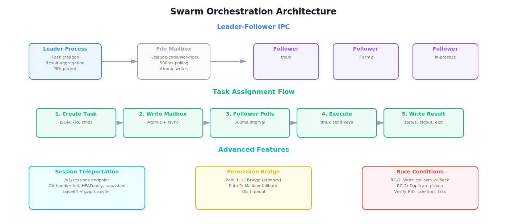
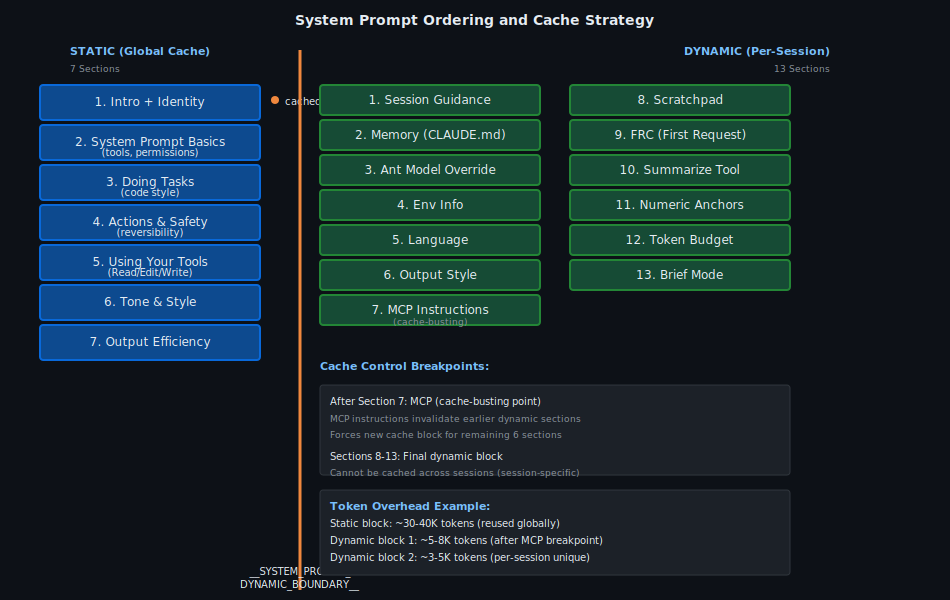
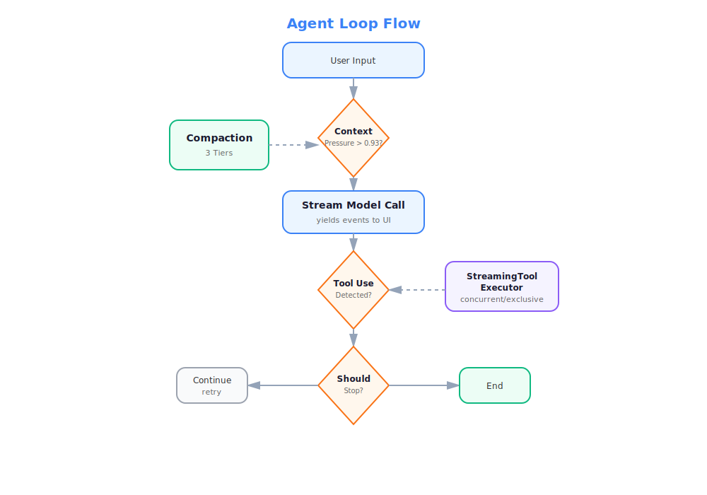

# How Claude Code Actually Works

> On March 31, 2026, a `.map` file in Claude Code's npm package accidentally exposed the full TypeScript source. We read all 512,000 lines. Here's everything we found.

[](https://github.com/instructkr/claude-code/stargazers)

---

## The Stuff They Don't Tell You

Claude Code isn't just a chat-in-terminal wrapper. It's a 1,902-file TypeScript monolith with its own React rendering engine, a multi-agent swarm system, a two-stage AI safety classifier, and 88 hidden feature flags — many for features that don't exist yet.

Here are some of the things we found buried in the source:

**There's a hidden AI that judges every command you run.** Before Claude Code executes a tool call, a separate classifier called "YOLO" runs a two-stage evaluation. Stage 1 is a fast 64-token scan. If it's suspicious, Stage 2 does a full 4,096-token reasoning pass to decide: allow, deny, or ask the user. Temperature is zero. It errs on the side of blocking. → [Full breakdown](05-security/README.md)

**Your conversations get secretly compressed.** When context pressure exceeds 93%, Claude Code runs one of six compaction strategies — from lightweight microcompaction (clearing old tool results) to spawning an entire forked subprocess that summarizes your conversation into a 9-section format. You never see this happen. → [How compaction works](04-systems/README.md)

**It ships an entire React rendering engine for the terminal.** Not a simple TUI library. A custom React Fiber reconciler, a Yoga flex-layout engine, a screen buffer with packed Int32Arrays, and a frame-diffing system that reduces terminal output from 10KB to 50 bytes on idle scroll. 7,743 lines of rendering code. → [Ink pipeline deep dive](01-architecture/README.md)

**Multi-agent "swarms" communicate through files on disk.** When Claude Code spawns parallel agents, they coordinate via a file-based mailbox system at `~/.claude/work/ipc/` with 500ms polling. The leader writes JSON task messages, followers pick them up. There's a documented race condition where a malicious task could hijack the permission bridge. → [Swarm architecture](07-agents/README.md)

**88+ feature flags control unreleased capabilities.** Build-time flags like `experimental_agents`, `enable_voice_input`, `unsafe_bash_allowed`, and `plugin_marketplace` reveal features in development. 600+ runtime flags prefixed `tengu_` are evaluated through GrowthBook. Dead code elimination strips inactive paths at build time. → [Feature flag matrix](08-history/README.md)

**The system prompt is 30-40K tokens of hidden instructions.** Split into 7 static sections (cached globally) and 13 dynamic sections (rebuilt per session), with a deliberate cache-busting boundary after MCP instructions that forces a new cache block. → [Prompt ordering map](03-prompts/README.md)

---

## What This Repository Is

82 analysis documents. 112,000+ lines of research. 15 architectural diagrams. Every major subsystem mapped, from the bootstrap sequence to the permission engine.

This isn't a shallow overview — it's a complete architectural reconstruction of how a production AI agent actually works under the hood.


---

## Use It As a Skill (Plug & Play)

This repo isn't just for reading. **Install the `/internals` skill** and your Claude Code agent autonomously consults its own architectural map while working on your tasks.

```bash
# One command — installs globally across all projects
mkdir -p ~/.claude/skills/internals && curl -sL \
  https://raw.githubusercontent.com/thtskaran/claude-code-analysis/master/.claude/skills/internals/SKILL.md \
  -o ~/.claude/skills/internals/SKILL.md
```

**What happens:** Claude Code gets a skill that auto-triggers when it detects situations where self-knowledge would help — context growing long, tools getting blocked, agents needing coordination, prompts needing optimization. It fetches the relevant document from this repo via WebFetch and applies the architectural knowledge in real-time.

You can also invoke it manually: `/internals compaction`, `/internals permissions`, `/internals agents`, etc.

→ **[Full install guide](INSTALL-SKILL.md)**

---

## Navigate by What You Want to Learn

### "How does it start up?"
The 10-step boot sequence, 4 entry points (CLI, SDK, MCP, Sandbox), 10 startup modes, and how parallel prefetching gets interactive mode ready in 1.2-1.8 seconds.
→ **[Architecture & Bootstrap](01-architecture/)** (12 docs, ~14,200 lines)

### "How does it talk to the API?"
Request assembly, provider routing across 4 cloud backends (Anthropic, AWS Bedrock, GCP Vertex, Azure), SSE streaming, exponential backoff retry with jitter, and token cost tracking.
→ **[Core Systems](04-systems/)** (19 docs, ~24,800 lines)

### "How does it decide what's safe to run?"
6 permission modes, rule cascade (project → global → managed), the YOLO two-stage classifier, 44 gitleaks secret-scanning rules, and a hand-rolled recursive-descent bash parser that flags 15 dangerous AST node types.
→ **[Security & Permissions](05-security/)** (10 docs, ~11,200 lines)

### "How do tools and plugins work?"
150+ commands, 3 dispatch types (prompt/local/local-jsx), a 6-phase plugin lifecycle with DFS dependency resolution, homograph attack detection, and 5 scope levels for enterprise control.
→ **[Tools & Plugins](06-tools-and-plugins/)** (14 docs, ~19,600 lines)

### "How do agents coordinate?"
Leader-follower swarms, file-based IPC, coordinator mode with XML task notifications, session teleportation via git bundles, and speculative execution with copy-on-write forking.
→ **[Agent Orchestration](07-agents/)** (8 docs, ~11,200 lines)

### "What hidden instructions does it follow?"
The full system prompt hierarchy, instruction precedence rules, 7 static + 13 dynamic sections, cache strategy, and the definitions that shape Claude's behavior.
→ **[Prompts & Instructions](03-prompts/)** (11 docs, ~18,500 lines)

### "How was the source extracted?"
Methodology, tools, validation techniques, and integrity checks used to catalogue the snapshot.
→ **[Extraction Methodology](02-master-extraction/)** (8 docs, ~9,100 lines)

### "What features are coming next?"
88 build-time feature flags, 600+ runtime gates, dead code elimination patterns, and version changelog.
→ **[Feature Evolution](08-history/)** (6 docs, ~4,100 lines)

---

## Architectural Diagrams

Every major subsystem has a corresponding diagram. Click to view full-size.

| | | |
|:---:|:---:|:---:|
|  |  |  |
| **System Architecture** | **Bootstrap Sequence** | **Rendering Pipeline** |
|  |  |  |
| **API Client Pipeline** | **Memory Systems** | **Compaction State Machine** |
|  |  |  |
| **Permission Engine** | **YOLO Classifier** | **Command Dispatch** |
|  |  |  |
| **Plugin Lifecycle** | **Streaming Executor** | **Swarm Orchestration** |
|  |  |  |
| **Prompt Ordering** | **Compaction Tiers** | **Agent Loop** |

---

## Numbers

| Metric | Count |
|--------|-------|
| Source files analyzed | 1,902 |
| Lines of TypeScript | 512,000+ |
| Analysis documents | 82 |
| Lines of analysis | 112,000+ |
| Architectural diagrams | 15 |
| Feature flags documented | 88+ |
| React hooks catalogued | 104 |
| Commands and tools mapped | 150+ |

---

## Tech Stack (What Claude Code Is Built With)

Bun runtime, TypeScript in strict mode, React + Ink for terminal UI, Commander.js for CLI parsing, Zod v4 for schema validation, ripgrep for code search, MCP SDK + LSP for protocol integration, OpenTelemetry + gRPC for telemetry, GrowthBook for feature flags, and OAuth 2.0 with macOS Keychain for auth.

---

## How the Source Became Available

On March 31, 2026, security researcher [Chaofan Shou](https://x.com/AntiFried_rice) noticed that Claude Code's npm package contained a `.map` file referencing unobfuscated TypeScript sources on Anthropic's R2 storage bucket — making the full `src/` tree publicly downloadable. Not a breach or hack. A packaging oversight.

This repository is a research archive of that snapshot. The original source remains Anthropic's property. We are not affiliated with Anthropic.

---

## Disclaimer

This is an educational and defensive security research project. It documents a real source exposure incident for the purpose of studying software supply-chain security and production AI agent architecture. The original Claude Code source is the sole property of Anthropic. This repository is not affiliated with, endorsed by, or maintained by Anthropic. The authors disclaim all liability for misuse.

---

If this helped you understand how AI agents work under the hood, consider giving it a ⭐
